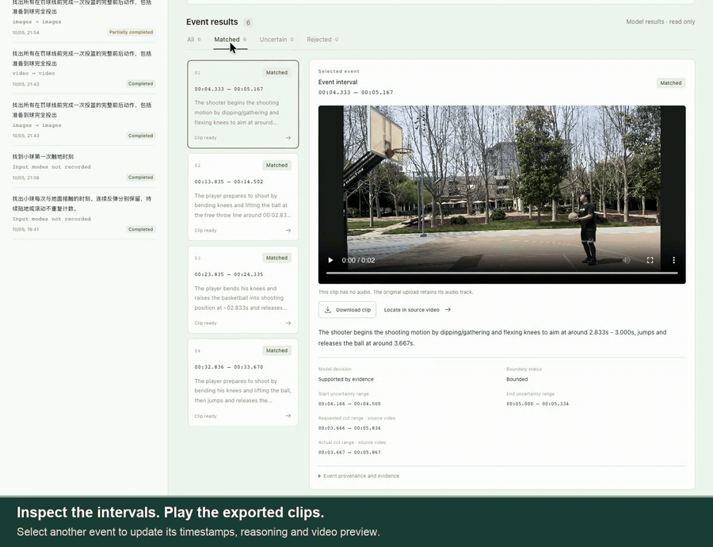
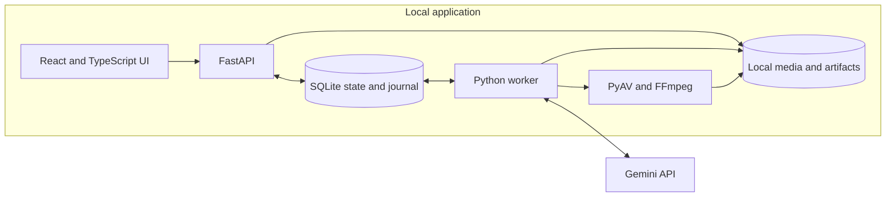
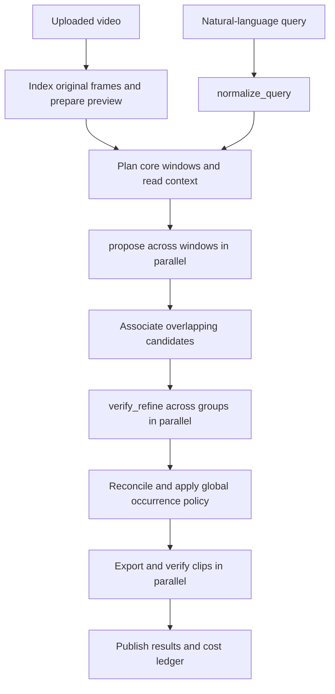

# Video Event Workbench

**Locate events in long videos, inspect the evidence, and export the matching clips.**

Video Event Workbench turns a video and a natural-language query into timestamped
event records and downloadable clips. It supports point events such as ball contact
and interval events such as a shooting motion or a grasp attempt. Every run exposes
its candidates, model responses, coverage, uncertainty, latency, and estimated cost.

**Status:** prototype · **Interface:** English and Chinese · **Execution:** local application with cloud Gemini inference

[Demo](#demo) · [Quick Start](#quick-start) · [Features](#features) · [Design Architecture](#design-architecture) ·
[Key Workflow](#key-workflow) · [Key Innovations](#key-innovations) · [Validation](#validation) ·
[Documentation](#documentation)

## Demo

[](docs/media/basketball-demo.mp4)

**[Watch or download the 73-second walkthrough](https://github.com/Michael-Ma/video-event-workbench/raw/refs/heads/main/docs/media/basketball-demo.mp4)** · [Captions](docs/media/basketball-demo.srt)

The recording shows the real interface with a saved Gemini run on a 54.8-second basketball
video: query and input settings, six matched shooting clips, playback and download,
source-video navigation, event evidence, per-call costs, and English/Chinese switching.
It plays brief excerpts rather than the whole source video. English captions are included.

The saved run took 47.7 seconds of processing and made nine model calls, with an estimated
USD 0.039614 total. The walkthrough reuses these results; recording it makes no new model calls.

## Why this project

Finding all occurrences of an action requires more than asking a model to summarize
a video. A useful workbench needs to account for the full timeline, revisit plausible
candidates, locate boundaries, preserve uncertainty, and produce clips that can be
traced back to the original frames.

This project brings those steps into one inspectable workflow. It is designed for
experiments with repeated sports actions, short visual events, and robot-task videos.
The current validation includes a synthetic engineering fixture and a real basketball
video; other domains still require their own evaluation.

## Features

- **Natural-language queries:** preserve the user's actor, object, ordering, and explicit
  success or failure conditions in a structured `QuerySpec`.
- **Point and interval events:** return an anchor or start/end boundaries, including
  uncertainty ranges and open boundaries.
- **Independent input modes:** choose `images` or `video` separately for `propose` and
  `verify_refine`; mixed combinations are supported.
- **Full-timeline scanning:** partition responsibility into core windows and add overlapping
  read context. Report completed coverage and gaps explicitly.
- **Candidate verification:** refine each group into zero, one, or multiple events, with
  candidate-to-event provenance retained.
- **Parallel processing:** overlap query parsing with media preparation and run independent
  scan windows, refinement groups, and clip exports with bounded concurrency.
- **Inspectable results:** view `matched`, `uncertain`, and `rejected` records, play clips,
  inspect evidence, and download artifacts.
- **Visible model costs:** show each call's input mode, token usage, latency, pricing snapshot,
  and estimated USD cost, plus known, unknown, and in-flight totals.
- **Durable execution records:** persist request intent before remote submission, retain
  partial results, and avoid automatically resubmitting unknown paid requests.

## Quick Start

### Run locally

The launcher supports macOS and Linux on arm64/x64. It prepares Python 3.13 with `uv`,
uses Node.js 22 or newer, installs locked dependencies, and checks FFmpeg/ffprobe.
Missing tools are installed where supported. Initial setup needs internet access and
`curl` or `wget`; system package installation may require administrator permission.

```sh
git clone https://github.com/Michael-Ma/video-event-workbench.git
cd video-event-workbench
./start.sh
```

Open **[http://127.0.0.1:5173](http://127.0.0.1:5173)** after the launcher reports
that all services are ready. Readiness requires the API, worker heartbeat, and frontend to be available.
Press **Ctrl+C** to stop all services started by the launcher.

### Try the engineering demo

Select **Load built-in fixture demo** and use **Fixture engineering test**. The generated 12-second
video uses declared event labels and requires no Gemini key or remote model call.
It exercises the pipeline, source-time mapping, exports, and UI; it does not measure
semantic recognition accuracy.

### Analyze a real video

The launcher creates `.env` from `.env.example` when it is missing. Replace the
placeholder with your Gemini API key, then restart:

```dotenv
GEMINI_API_KEY=YOUR_API_KEY
GEMINI_MODEL=gemini-3.8-flash
```

Use the language selector in the header to choose **English** or **Chinese**. The app
remembers your selection; existing queries and model output retain their original text.

1. Upload or select a video and enter a query.
2. Choose a processing preset and the input mode for each model stage.
3. Start the run and inspect progress, coverage, costs, and output clips.
4. Change the settings and create another run to compare input combinations. Each run
   freezes its configuration; recent-run labels identify the combination used.

The key stays in the backend. Selected images or prepared video windows are sent to
Google's Gemini API. Current model inputs, previews, and exported clips contain **no audio**;
the original upload retains its audio track.

Useful startup options:

```sh
./start.sh --check
./start.sh --require-api-key
```

Key checking verifies local presence only; it does not make a model request or authenticate
the key remotely. A port conflict fails without terminating another application's service.

### Example queries

| Event kind | Query |
| --- | --- |
| Point | Find every visible ball-ground contact and include one second before and after. |
| Interval | Find each shooting motion, from the start of the knee bend to the ball leaving the hands; include missed shots. |
| Interval | Find every complete grasp attempt, from approaching the object until the attempt ends, including failed attempts. |

## Design Architecture



| Component | Responsibility | Source |
| --- | --- | --- |
| Web UI | Uploads, frozen run settings, progress, result playback, cost ledger | [`web/src`](web/src) |
| API | Run creation, history, cancellation, diagnostics, HTTP artifact serving | [`main.py`](backend/app/main.py) |
| State and contracts | Durable media/run/task records and validated data shapes | [`db.py`](backend/app/db.py), [`contracts.py`](backend/app/contracts.py) |
| Worker and pipeline | Queue ownership, bounded scheduling, snapshots, recovery | [`worker.py`](backend/app/worker.py), [`pipeline.py`](backend/app/pipeline.py) |
| Temporal bookkeeping | Window planning, source-time mapping, grouping, reconciliation, global selection | [`algorithms.py`](backend/app/algorithms.py) |
| Media processing | Frame index, navigation preview, sampled images, native video windows, verified cuts | [`media.py`](backend/app/media.py) |
| Model boundary | Stage prompts, structured requests/responses, explicit input modes and retry controls | [`providers.py`](backend/app/providers.py) |
| Cost accounting | Versioned price snapshots, usage-based estimates, unknown-cost handling | [`billing.py`](backend/app/billing.py) |

SQLite and local artifacts own durable execution state. Gemini supplies observations and
event proposals; backend code validates their locations, determines result buckets, applies
global occurrence rules, and exports clips. One worker processes queued runs, with bounded
parallel work inside each run.

## Key Workflow



| Stage | Input | Output |
| --- | --- | --- |
| Prepare media | Original video | Immutable source-frame index, preview, source-time mapping |
| `normalize_query` | Raw query and preset; text only | `QuerySpec` with required evidence, exclusions, boundaries, and `all`/`first`/`last` policy |
| Plan and `propose` | Query rules and timestamped images or local video windows | Coarse candidates, evidence, uncertainty, and per-window completion |
| Group candidates | All scan proposals | Bounded groups that retain every source candidate |
| `verify_refine` | Candidate group and denser local input | Zero/one/many events plus `candidate_dispositions` |
| Reconcile | Refined events and scan gaps | Final `matched`/`uncertain`/`rejected` records, duplicate handling, global selection |
| Export and publish | Final events and original video | Verified MP4 clips, `results.json`, provenance, diagnostics, usage and costs |

Query parsing overlaps media preparation. Scan windows finish before grouping; refinement
finishes before global reconciliation and export. Incomplete scan responses can lead to
smaller child windows. Open refinement boundaries can trigger bounded context expansion.
Unknown remote outcomes stop new paid submissions.

`propose` enumerates local candidates even for a `first` or `last` query. The backend applies
that policy globally after reconciliation, and preserves uncertainty when scan gaps prevent
a global claim.

## Key Innovations

The project's main contributions are engineering choices that make event localization
inspectable and easier to test:

1. **Separate discovery from verification.** Coarse scans prioritize finding plausible
   candidates; local refinement can reject a false proposal, combine duplicate proposals,
   or split a compound proposal into multiple events. An empty response is not blanket rejection.
2. **Compare input modes without changing the workflow.** Each visual stage accepts images
   or native video through the same temporal contract. Image evidence uses supplied frame IDs;
   video evidence uses validated timestamps and preserves its distinct sampling uncertainty.
3. **Keep the original timeline as the common reference.** Model-local seconds are mapped
   from the actual input origin to source microseconds. VFR timestamps, uncertainty ranges,
   clip mappings, and container-duration quantization are retained for inspection. Timestamp
   precision is separate from semantic boundary accuracy.
4. **Associate candidates without discarding observations.** Cross-window identity names
   can differ. Complete-link overlap grouping provides joint context to refinement while
   retaining all candidate IDs and allowing multiple final events.
5. **Treat paid requests as durable operations.** Intent and budget reservation are saved
   before the network boundary. Concurrency is bounded; unknown outcomes are not silently
   retried; received usage remains recorded after cancellation or validation failure.
6. **Expose completion, uncertainty, and cost separately.** Successful scan coverage is
   measured over core ranges. Uncertain events receive explicit context previews. Cost
   totals include known estimates while leaving missing or in-flight usage unresolved.

## Configuration

Most controls are available in the UI's advanced settings. [`RunConfig`](backend/app/contracts.py)
is the complete reference.

| Setting | Default | Purpose |
| --- | --- | --- |
| Model | `gemini-3.8-flash` | Shared model for query parsing, scanning, and refinement |
| Scan / refine input | `images` / `images` | Independently selectable; `video` and mixed combinations supported |
| Action scan | 30-second core, 5-second context per side, 2 FPS | Repeated interval events |
| Point scan | 10-second core, 2-second context per side, 6 FPS | Short visual events |
| Refine sampling | 6 FPS, 2-second padding | Local verification and boundary refinement |
| Input budget | 160 sampled or nominal frames, maximum width 768 | Bounds input preparation; native FPS is capped at 24 |
| Model / clip concurrency | `2` / `2` | Bounds independent work within a run |
| Request timeout | 1200 seconds | Remote request timeout |
| Generation | `thinking=low`, `temperature=1`, output limit 16,384 tokens | Output budget includes thinking |
| Request budget | 500 calls | Includes submitted intents; prevents unbounded processing |
| Boundary tolerance | 1000 milliseconds | Backend result-classification threshold |

Window planning may shorten a core to fit the frame budget while preserving the requested
sampling density. Refinement input is also bounded by its FPS and frame cap. For models
outside the Gemini 3 family, select provider-default thinking. Price estimates currently
cover `gemini-3.8-flash`; unsupported pricing remains unknown.

Environment settings:

| Variable | Default | Meaning |
| --- | --- | --- |
| `GEMINI_API_KEY` | Empty | Backend-only key; omitted for the fixture demo |
| `GEMINI_MODEL` | `gemini-3.8-flash` | Default model for new runs |
| `VEW_DATA_DIR` | `.data` | Local state and artifacts |
| `VEW_MAX_UPLOAD_MB` | `2048` | Local upload limit, separate from provider request limits |

## Results and Artifacts

| Result bucket | Meaning | Export behavior |
| --- | --- | --- |
| `matched` | Supported event with bounded location and acceptable uncertainty | Event clip with configured context |
| `uncertain` | Unresolved evidence, boundaries, or instance conflict | Explicit context preview when enabled |
| `rejected` | Model decision says the query is not satisfied | No formal matching clip |

Each event retains its source candidate IDs, original-video location, evidence references,
matching reason, uncertainty reasons, and clip metadata. Missing candidate dispositions
remain unresolved. Consistent rejected/unresolved mappings preserve the original decision;
contradictory mappings fail validation.

Artifacts live under `.data/`:

```text
.data/
├── state.sqlite3                   # Media, run, task, log and worker state
├── media/                         # Original video, preview and source-frame index
└── runs/<run_id>/
    ├── input.json                 # Query, configuration and prompt version
    ├── window_plan.json           # Core/read ranges and effective windows
    ├── inputs/                    # JPEGs or MP4 windows and their mappings
    ├── query/, scan/, refine/      # Request/response/error receipts by task and attempt
    ├── candidates.json
    ├── candidate_groups.json
    ├── all_events.json
    ├── clips/
    ├── progress_results.json
    ├── results.json
    └── debug.jsonl
```

Cost records retain the model, operation, usage, pricing version, and latency. Estimates
account for cached input and thinking tokens. They are paid Standard list-price estimates,
not billing receipts. Unknown costs are not zero; local fixture calls are explicitly free.
Reusing a saved response does not create another paid-call entry.

`.env`, uploaded videos, runtime data, dependencies, and build artifacts are excluded from Git.

## Validation

The latest validated snapshot on **2026-10-06** passed **142 backend tests**, **56 frontend
tests**, Ruff, and the TypeScript/Vite build. Coverage includes real local FFmpeg operations,
all four input combinations, VFR/source-time mapping, bounded concurrency, atomic budgets,
unknown requests, cancellation, cost receipts, and candidate association rules. Automated
tests do not make paid Gemini calls. Localization checks cover language negotiation,
saved error translation, persisted preferences, and unchanged queries, event records,
technical evidence, and costs across language changes.

A live smoke comparison used the same 54.8-second basketball video and query, scan 2 FPS,
refine 6 FPS, concurrency 2, and low thinking:

| Input combination | Processing time | Automatic decisions | Exported clips | Estimated USD |
| --- | --- | --- | --- | --- |
| `images` → `images` | 66.8 seconds | 5 matched, 1 rejected | 5 | 0.335336 |
| `video` → `video` | 47.7 seconds | 6 matched | 6 | 0.039614 |

Processing time excludes queue and manual debugging wait. The image results were locally
reparsed from saved responses after a mapping-compatibility fix, without another Gemini call
or a change to model matching decisions. The methods disagree on the final shot's position
requirement. This single-video check does not establish recall, precision, or general accuracy
superiority. See [the validation record](docs/VALIDATION.md) for the evidence and scope.

## Limitations

- One local user and one worker; there is no distributed queue or multi-user access layer.
- Sparse observations can miss short events. Native video sampling is performed by the provider
  and is not exposed as a verified observation log.
- Full core coverage and a completed run do not prove that every matching event was found.
- Automatic event records are not human-confirmed annotations or training ground truth.
- The current scope excludes manual annotation, skill scoring, dataset curation UI, and robot
  policy training or execution.
- Media inputs and exported clips are visual-only. An already-submitted model request may
  finish and produce usage after cancellation.
- Hour-long throughput, broad camera/domain coverage, and semantic accuracy on complete
  held-out videos remain evaluation priorities.

## Development

```sh
uv sync --locked --extra dev
uv run ruff check --config pyproject.toml backend scripts
uv run pytest -q
npm --prefix web ci
npm --prefix web test
npm --prefix web run build
```

The [Checks workflow](.github/workflows/checks.yml) runs lint, startup syntax validation,
backend tests, frontend tests, and the production build. Fixtures and mocked provider
boundaries keep these checks independent of paid API access.

## Documentation

| Document | Read it for |
| --- | --- |
| [API contract](docs/API.md) | Endpoints, time units, data contracts, costs, and artifact access |
| [Design architecture and decisions](docs/design.md) | Pipeline rationale and implementation decisions |
| [UI design](DESIGN.md) | Interaction states, visual system, and responsive behavior |
| [Implementation plan](docs/IMPLEMENTATION_PLAN.md) | Dependency structure and original delivery plan |
| [Validation record](docs/VALIDATION.md) | Automated checks, live comparisons, and remaining evaluation scope |
| [Source design Page](https://chatgpt.com/space/page_c6399f3467e88191aaf8beb5a250cb29) | Original design and appended implementation decisions |

The FastAPI OpenAPI UI is available at [http://127.0.0.1:8000/docs](http://127.0.0.1:8000/docs)
while the app is running.
