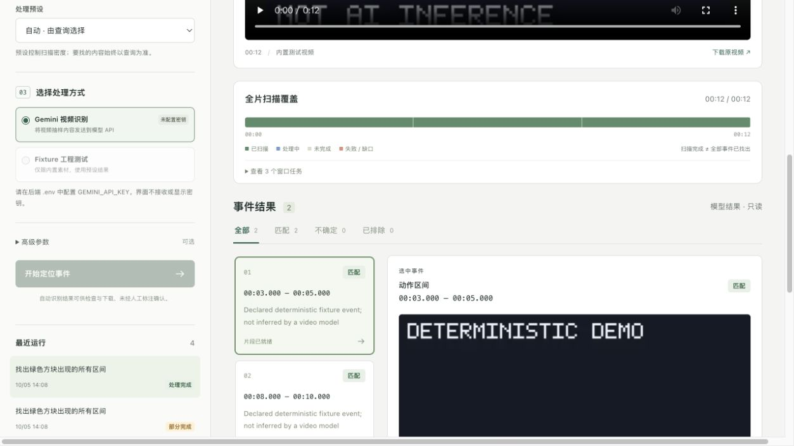

# Validation record

Validated on 2026-10-05 using Python 3.13.12, PyAV 19.0.1, FFmpeg 8.1.1,
Node.js 24.15.0, the locked Python environment and web package lock.

## Automated checks

- Python: **54 tests passed**. One dependency deprecation warning from Starlette's
  httpx test client; no failed or skipped checks in this environment.
- Python lint: passed with the repository's explicit Ruff configuration.
- Frontend: TypeScript and Vite production build passed; **4 tests passed**.

The suite covers exhaustive core ranges and failed-window gaps; observed PTS mapping;
actual VFR input with a 5-second source origin; unique frame sampling and frame caps;
rotation; source content and timestamps after real FFmpeg cuts; 0/1/N refinement;
missing candidate dispositions; conservative duplicate/conflict handling; global first/last;
request intent recovery; no automatic retry of unknown submissions; cancellation and late
responses; concurrent SQLite claims/idempotency; API upload errors and traversal denial;
HTTP video range serving; prepared-media reuse; and call-budget interruption.

Three integration cases use the real API, SQLite, synthetic video, PyAV and FFmpeg:
all intervals spanning three core windows, first point, and last point. Exported videos
are decoded and checked against their frame counts and original time metadata.
Gemini adapter checks use a mocked SDK boundary. No API key or paid call was used.

## Browser checks

The combined launcher starts all three services and shuts them down together.
The in-app browser verified demo import, submission, queue/cancellation, restored history,
two point events at 3 and 9 seconds, two intervals at 3–5 and 8–10 seconds, three-window
coverage, and clips ready for playback/download. Both source and clip video elements
loaded with no media error. Source positioning jumped to the expected 3-second location.

A one-call fixture budget produced a partial run, zero completed coverage, and the
visible 0–12-second gap. Debug records showed request, response, window plan, candidate
groups and result links. The final page had no browser error/warning messages.
Desktop and 390-pixel layouts were inspected; the narrow layout had no horizontal overflow.

## Pending real-video validation

The deterministic fixture has declared labels. It does **not** validate natural-language
understanding, semantic recall, real-world instance identity or boundary accuracy.
The next test requires a Gemini key and complete user videos, including repeated and
short events. Hour-long decode performance, actual provider acceptance/latency/cost,
occlusion and real camera conditions remain unmeasured. Sampled visual input and exported
clips contain no audio. These limits are also shown in the app and source design.
